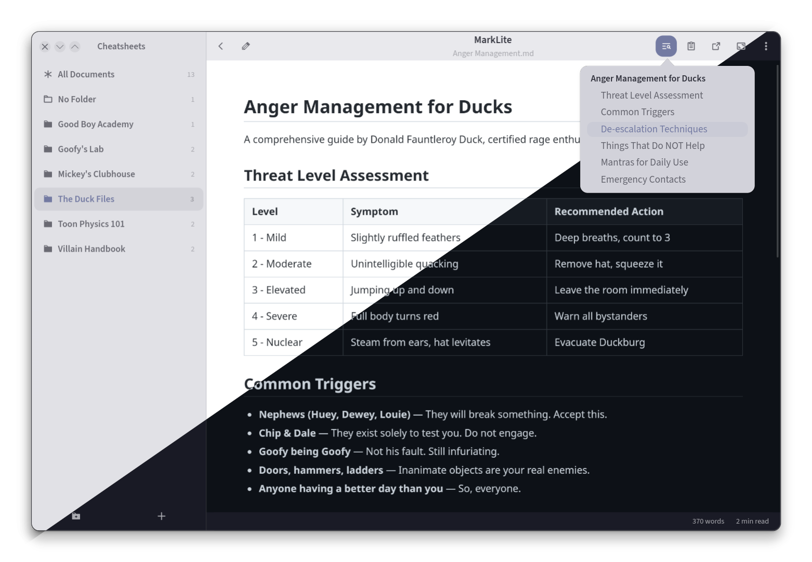

# MarkLite

Your markdown librarian. A lightweight GTK4 Markdown reader and editor.

> **Alpha software.** Still tightening the screws..


## Features

- Folder sidebar with document panel — browse and manage markdown files
- Subfolder navigation — drill into nested folders from the document panel
- Root folder switcher — quickly change scope via the sidebar header
- Open a directory from the command line: `marklite ~/path/to/notes/`
- WebKit-based rendered markdown view with syntax highlighting
- CodeMirror 6 editor with live preview pane and scroll sync
- Dark mode — follows system theme
- File management — rename, move, trash, delete empty folders, create documents from context menu
- File watching — auto-reloads on disk changes
- Task list checkboxes — toggle directly in the rendered view
- Table of contents popover — navigate headings, click to scroll
- Export to PDF (via menu), open in external app, copy as rich text
- Remember last folder across sessions (optional, in Preferences)
- Configurable keyboard shortcuts, fonts, and themes

## Dependencies

- Python 3.10+
- GTK 4.0, libadwaita 1
- WebKitGTK 6.0
- python-markdown, Pygments
- Meson, Ninja (build)

## Install

### Arch Linux

```bash
pacman -S python python-gobject gtk4 libadwaita webkitgtk-6.0 python-markdown python-pygments meson ninja
makepkg -sic
```

### Debian / Ubuntu

```bash
sudo apt install ./marklite_*.deb
```

### From source

```bash
meson setup builddir --prefix=/usr
meson compile -C builddir
sudo meson install -C builddir
```

## Usage

```bash
marklite                    # opens the configured root directory
marklite ~/Cloud/Notes/     # opens a specific directory (session only)
```

## Configuration

Settings are stored in `~/.config/marklite/settings.json` and can be changed from the Preferences dialog. All changes take effect immediately.

## License

MIT

## Screenshots




## Disclaimer

This project was developed with AI assistance. The code has been analysed with Codacy and Bandit. Use at your own discretion.  
[](https://app.codacy.com/gh/mkay/marklite/dashboard)